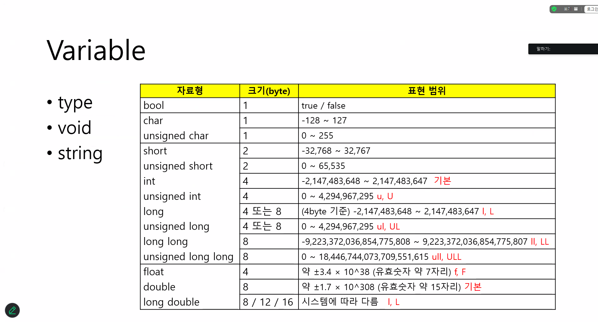

# iot-c++2026
iot개발자 과정 c++리포지토리

### C++버전

## 1일차
1. 입출력 방식(iostream)[소스](./basic/base/base02/base02.cpp)
C++은 printf, scanf대신 iostream 헤더를 사용한 새로운 입출력방식을 제공합니다.
- 입출력: std::cin, std::cout 사용 (서식 지정자 불필요, std::endl 개행).
- 특징: C언어와 달리 별도의 서식 지정(%d, %df등)이 불필요하며, 데이터의 유형에 따라 적절한 입출력이 자동으로 이루어진다.

2. `함수 오버로딩, 함수 오버라이딩`
- `함수 오버로딩 (Function Overloading)`
같은 이름의 함수를 여러 개 만드는 것입니다. 카페에서 "주문받기"라는 행동은 같지만, 손님이 "메뉴판 번호"를 말할 때와 "메뉴 이름"을 말할 때 처리 방식이 다른 것과 같습니다.

핵심: 이름은 같지만 `매개변수(타입, 개수)`가 달라야 함.

목적: 유사한 기능을 하는 함수들을 하나의 이름으로 관리하여 편의성을 높임.

- `함수 오버라이딩 (Function Overriding)`
상속 관계에서 부모 클래스의 함수를 자식 클래스에서 다시 만드는 것입니다. 부모님이 물려주신 "가업"이 마음에 안 들어서 내 방식대로 "새로 정의"하는 상황입니다.

핵심: 함수의 이름, 매개변수, 반환형이 완전히 동일해야 함.

목적: 부모 클래스의 기능을 자식 클래스에 맞게 변경하거나 확장하기 위함 (다형성 구현).

3. 디폴트 매개변수: 인자 생략 시 기본값 적용. (오른쪽 매개변수부터 채워야 함)

4. 인라인 함수: inline 키워드로 함수 호출을 몸체 코드로 치환 (성능 최적화).

5. 이름 공간(Namespace): :: 연산자로 식별자 충돌 방지 (std:: 등).

## 2일차. 메모리 & 참조자 (Reference) ##

1. 새로운 자료형 bool 💡C언어에서는 0과 1로 참/거짓을 따졌지만, C++에서는 전용 자료형이 생겼습니다.
- true / false: 참과 거짓을 나타내는 데이터입니다.
- bool: 이 데이터들을 저장하기 위한 자료형으로, 크기는 1바이트입니다

2. 실행 데이터 영역 (Memory Layout)
C++ 프로그램 실행 시 메모리는 크게 다음 네 영역으로 나뉩니다.

- 데이터(Data) 영역: 전역변수가 저장되는 공간

- 스택(Stack) 영역: 지역변수 및 매개변수가 저장되는 공간

- 힙(Heap) 영역: 프로그래머가 원하는 시점에 할당하고 소멸시키는 공간

- 코드(Code) 영역: 실행할 프로그램의 코드가 저장되는 공간

3. 참조자(Reference): 변수의 별명(&). 메모리 추가 점유 없이 원본에 접근.

- Call-by-Reference: 포인터 연산 없이 외부 변수 수정 가능.

- const 참조자: 원본 변경 방지 및 상수(Literal) 참조 가능.

- 포인터 참조: int* &pref = ptr; (포인터 변수 자체를 참조).

- new & delete: C++ 동적 할당 연산자. (생성자/소멸자 자동 호출).

- bool 타입: true(1) / false(0) 전용 자료형 (1바이트).

## 3일차 ##

1. 참조자(Reference)와 포인터(Pointer) [소스](./basic/base02/ref02/ref02.cpp)

메모리에 접근하고 값을 조작하는 세 가지 방법을 비교 학습함.

- 일반 변수 (num): 실제 데이터가 담긴 공간.
- 참조자 (&ref): 기존 변수에 붙이는 별명. 선언 시 반드시 초기화해야 하며, 별칭을 통해 원본을 직접 조작.
- 포인터 (*pnum): 주소 값을 저장하는 변수. * 연산자(역참조)를 통해 해당 주소로 가서 값을 조작.

- Key Point: 참조자(ref)와 원본(num)은 주소값이 동일함(&num == &ref).

2. 함수와 매개변수 전달 (Call by Reference)

함수 내부에서 외부 변수의 값을 수정하기 위해 참조 매개변수를 활용함.
- void change_val(int& n): 인자를 참조로 받아 함수 내부의 변화가 호출한 곳(main)에 그대로 반영됨.

- 반환 타입이 참조일 때 (int&): 값을 복사하지 않고 원본의 참조를 그대로 전달하려 할 때 사용. (단, 지역 변수를 참조로 반환하는 것은 위험하므로 주의 필요)

3. 상수 참조자 (Constant Reference)

- 일반 참조자는 리터럴(상수, 예: 4)을 참조할 수 없지만, const int& ref = 4;와 같이 const를 붙이면 상수 값을 가리킬 수 있음. (임시 객체의 수명 연장)

4. C 스타일 문자열 처리 (char 배열) [소스](./basic/base02/array01/array01.cpp)

C++의 std::string 대신 C 언어 방식의 char 배열을 다루는 법을 학습함.

- 대입의 한계: 배열명은 상수 주소이므로 name1 = "hong"과 같은 직접 대입이 불가능함.

- strcpy 활용: 문자열 복사를 위해 strcpy(대상, 원본) 함수를 사용함. (보안 경고 해결을 위해 #define _CRT_SECURE_NO_WARNINGS 필요)

- 입력 (cin): cin >> name 사용 시 공백(스페이스)을 기준으로 입력을 끊음.

5. 문자열 처리

C++에서 char 배열로 문자열을 다룰 때 주의해야 할 핵심 사항입니다.
    

6. 클래스(Class) 구조:

- private: 데이터 캡슐화 (외부 접근 차단).

- public: 인터페이스 (외부 공개).

7. 생성자(Constructor): 객체 생성 시 자동 호출되는 초기화 함수.

8. 초기화 리스트 (Initializer List)
생성자에서 멤버 변수를 초기화하는 가장 효율적인 방법입니다.

- 문법: ClassName() : member(val) { }

- 필수 사용: const 멤버, 참조자 멤버 초기화 시.

- 장점: 대입이 아닌 선언과 동시에 초기화되므로 성능 우수.

요약 노트
- 문자열: char 배열은 까다로우니 strcpy를 기억하자! (실무에서는 주로 std::string을 권장함)

- 생성자: 객체가 생성될 때 자동으로 호출되는 특수 함수.

- 초기화 리스트: : 뒤에 변수명을 적는 습관을 들이자. 성능과 기능면에서 더 우수하다.

## 4일차 ##

1. 클래스 포함 관계와 초기화 리스트 (Initialization List) [소스](./basic/base03/init02/init02.cpp)

- 포함(Composition): 한 클래스가 다른 클래스의 인스턴스를 멤버 변수로 가지는 구조입니다.

- 초기화 리스트 (: p(x, y)): 멤버 객체를 생성과 동시에 초기화할 때 사용합니다.

- 특징: 대입 연산보다 효율적이며, 기본 생성자가 없는 멤버 객체를 초기화할 때 반드시 필요합니다.

2. 복사 생성자 (Copy Constructor) [소스](./basic/base03/copy/copy01.cpp)
- 정의: 기존에 생성된 객체를 이용하여 새로운 객체를 초기화할 때 호출되는 특별한 생성자입니다.

- 형태: ClassName(const ClassName& other)

- 호출 시점:

(1). Person p2(p1); 처럼 명시적으로 복사할 때

(2). Person p2 = p1; 처럼 대입하며 생성할 때

(3). 객체를 함수의 인자로 전달하거나 반환할 때

3. 깊은 복사(Deep Copy) vs 얕은 복사(Shallow Copy)
- 얕은 복사 [소스](./basic/base03/copy/copy2.cpp) 
- 멤버 변수의 값을 단순히 복사합니다. 포인터 멤버가 있을 경우 주소값만 복사되어 두 객체가 같은 메모리를 가리키는 위험(Double Free)이 발생합니다.

- 깊은 복사 [소스](./basic/base03/copy/copy03.cpp) 
- 포인터가 가리키는 실제 데이터를 위한 `새로운 메모리 공간을 할당(new)`하고 내용을 복사합니다. 객체 간의 독립성이 보장됩니다.

4. 소멸자 (Destructor) [소스](./basic/base03/copy/copy2.cpp)
- 역할: 객체가 수명을 다하고 사라질 때 자동으로 호출되어 메모리 해제 등 뒷정리를 담당합니다.

- 특징: ~클래스명() 형태로 정의하며, 생성된 역순으로 호출됩니다. 동적 할당한 자원(new)은 여기서 delete 해줘야 메모리 누수를 방지할 수 있습니다.

5. const 객체와 멤버 함수 오버로딩 [소스](./basic/base03/)
- const 멤버 함수: 함수 내부에서 멤버 변수의 값을 변경하지 않음을 보장합니다. void Func() const; 형태로 선언합니다.

- 호출 규칙:

(1) 일반 객체는 일반 함수를 우선 호출합니다.

(2) 상수(const) 객체는 오직 const 멤버 함수만 호출할 수 있습니다.

- 상수 참조(const &): 함수 인자로 객체를 받을 때, 원본을 수정하지 않으면서 성능(복사 방지)을 챙기기 위해 주로 사용하며, 이때도 내부에서는 const 멤버 함수만 실행됩니다.

6. 이동 생성자 (Move Constructor) [소스](./basic/base03/moveconstructor/moveconstructor.cpp)
- 정의: 기존 객체의 자원을 복사하지 않고, 새 객체로 `소유권을 이전`하는 생성자입니다.

- 형태: ClassName(ClassName&& other) noexcept

## 특징:

- std::move()를 통해 호출되며, 대용량 데이터를 가진 객체에서 불필요한 메모리 할당/복사를 줄여 성능을 극대화합니다.

- `R-value 참조(&&)`를 사용하며, 이동 후 원본 객체는 대개 초기화(null 등) 처리합니다.

- 멤버가 배열일 경우 실제 복사가 일어나므로, 주로 동적 할당 포인터를 멤버로 가질 때 효과가 큽니다.

7. 변환 생성자 (Conversion Constructor) [소스](./basic/base03/conversioncstructor/conversioncstructor.cpp)

- 정의: 인자를 하나만 받는 생성자로, 특정 타입의 데이터를 클래스 타입으로 '암시적 형변환' 시켜줍니다.

- 특징: Time t = 100; 처럼 정수형 데이터를 객체에 대입하는 식의 유연한 코딩이 가능해집니다.

- 주의사항 (explicit):
- 의도치 않은 자동 형변환이 버그를 유발할 수 있습니다.
- 이를 막으려면 생성자 앞에 explicit 키워드를 붙여 명시적 호출만 허용하도록 설정합니다.

## 5일차 

- 절차형 패러다임 + 객체 지향 패러다임

 bool, char, int, long , double

- Programing Language

- 프로그래밍 언어의 schema

- input -> precessing -> output
1. operater: 연산
2. condition: 조건
3. Loop: 반복

bariable

. type
. void
. string

- 자료형

1. 변수와 자료형 (Variables & Types) [소스](./spaceCpp/chap01/Basic/01_variable.cpp)
데이터를 저장하는 방식과 컴퓨터가 숫자를 처리하는 한계를 학습했습니다.

네임스페이스(Namespace): A::printAll(), B::printAll()처럼 이름 충돌을 방지하기 위해 구역을 나눕니다.

형변환(Casting): * 암묵적 형변환: double + int 시 자동으로 큰 자료형으로 변환.

명시적 형변환: static_cast<int>(variable)를 사용하여 개발자가 직접 변환.

오버플로우(Overflow): 자료형이 담을 수 있는 최대치를 넘으면 inf(무한대)나 예상치 못한 값이 출력됩니다. [소스](./spaceCpp/chap01/Basic/02_casting.cpp)

2. 연산자와 출력 조정자 (Operators & I/O Manipulators) [소스](./spaceCpp/chap01/Basic2/03_operator.cpp)

복합 대입 연산자: n4 += n3 *= 40와 같이 오른쪽에서 왼쪽으로 연산되는 우선순위를 확인했습니다.

진법 출력: hex(16진수), dec(10진수), oct(8진수) 및 bitset을 이용한 2진수 출력.

포맷팅: boolalpha(true/false 출력), setw()(출력 칸수 지정), showbase(진법 접두사 표시).

3. 조건문 (Conditional Statements) [소스](./spaceCpp/chap01/Basic2/04_condition.cpp)
상황에 따라 프로그램의 흐름을 바꾸는 방법을 비교 학습했습니다.

if-else 문: &&(AND), ||(OR) 논리 연산자를 사용하여 넓은 범위를 체크할 때 유리합니다.

switch-case 문: 정해진 값(정수, 문자)에 따라 분기하며, break를 통해 흐름을 제어합니다.

4. 반복문과 흐름 제어 (Loops & Control)
중첩 반복문과 루프 내에서의 세밀한 제어를 실습했습니다.

중첩 for문: 구구단 예제를 통해 "단 - 줄 - 칸"의 3중 구조로 데이터를 배치하는 법을 배웠습니다. [소스](./spaceCpp/chap01/Basic2/05_for.cpp)

while(true) 무한 루프: 특정 조건이 충돌할 때까지 반복하며 break로 탈출합니다.[소스](./spaceCpp/chap01/Basic2/06_while.cpp)

break vs continue: * break: 반복문을 즉시 종료.[소스](./spaceCpp/chap01/Basic2/07_break_continue.cpp)

continue: 현재 차례만 건너뛰고 다음 반복으로 진행.

5. 시간 제어 및 애니메이션 (Time & UI)[소스](./spaceCpp/chap01/Basic2/08_function_library.cpp)
콘솔 창에서 정적인 출력을 넘어 동적인 효과를 주는 법을 배웠습니다.

this_thread::sleep_for: 프로그램을 지정된 시간(초, 밀리초) 동안 멈춥니다.

\r (Carriage Return): 커서를 줄 맨 앞으로 보내 기존 출력을 덮어쓰는 '카운트다운' 효과를 구현했습니다.

6. 함수와 값 전달 (Function & Pass by Value)[소스](./spaceCpp/chap01/Basic2/09_funtion_args1.cpp)
함수의 정의와 데이터가 전달되는 방식을 이해했습니다.

값에 의한 전달 (Pass by Value): 함수에 인자를 전달할 때 복사본이 넘어가므로, 함수 내부에서 매개변수를 수정해도 main의 원본 변수에는 영향을 주지 않습니다.

함수 프로토타입: 함수를 사용하기 전 상단에 미리 선언하여 컴파일 에러를 방지합니다.