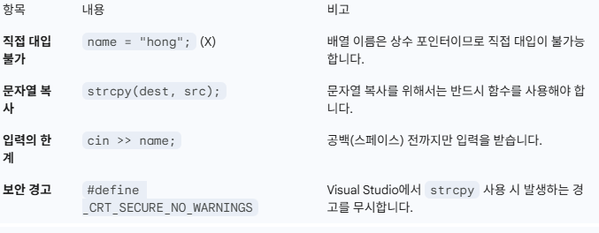

# iot-c++2026
iot개발자 과정 c++리포지토리

### C++버전

## 1일차
1. 입출력 방식(iostream)
C++은 printf, scanf대신 iostream 헤더를 사용한 새로운 입출력방식을 제공합니다.
- 출력: std::cout << 출력대상; 형태를 사용하며, std::endl을 통해 개행(줄바꿈)을 수행합니다.
- 입력: std::cin >> 변수; 형태를 사용합니다
- 특징: C언어와 달리 별도의 서식 지정(%d, %df등)이 불필요하며, 데이터의 유형에 따라 적절한 입출력이 자동으로 이루어진다.

2. `함수 오버로딩, 함수 오버라이딩`
- `함수 오버로딩 (Function Overloading)`
같은 이름의 함수를 여러 개 만드는 것입니다. 카페에서 "주문받기"라는 행동은 같지만, 손님이 "메뉴판 번호"를 말할 때와 "메뉴 이름"을 말할 때 처리 방식이 다른 것과 같습니다.

핵심: 이름은 같지만 `매개변수(타입, 개수)`가 달라야 함.

목적: 유사한 기능을 하는 함수들을 하나의 이름으로 관리하여 편의성을 높임.

- `함수 오버라이딩 (Function Overriding)`
상속 관계에서 부모 클래스의 함수를 자식 클래스에서 다시 만드는 것입니다. 부모님이 물려주신 "가업"이 마음에 안 들어서 내 방식대로 "새로 정의"하는 상황입니다.

핵심: 함수의 이름, 매개변수, 반환형이 완전히 동일해야 함.

목적: 부모 클래스의 기능을 자식 클래스에 맞게 변경하거나 확장하기 위함 (다형성 구현).

3. 매개변수의 디폴트 값 (Default Value)
함수 호출 시 인자를 전달하지 않았을 때 기본적으로 채워지는 값을 지정할 수 있습니다. 
- 특징: 함수의 선언부에만 위치시켜야 하며, 전달되는 인자는 왼쪽부터 채워지기 때문에 디폴트 값은 반드시 오른쪽 매개변수부터 채워야 합니다.

4. 인라인 함수 (Inline Function)
매크로 함수의 장점(성능 향상)은 취하고 단점(복잡한 정의)을 보완한 기능입니다. 
- inline 키워드를 사용하여 선언하며, 컴파일러에 의해 함수 호출 문장이 함수의 몸체 부분으로 직접 치환됩니다.

5. 이름 공간 (Namespace)
프로젝트가 커짐에 따라 발생할 수 있는 이름 충돌을 방지하기 위해 만들어진 공간입니다. 

- 범위 지정 연산자(::): 특정 이름 공간에 정의된 함수나 변수에 접근할 때 사용합니다. 
- std: C++ 표준에서 제공하는 cout, cin, endl 등은 모두 std라는 이름 공간 안에 선언되어 있습니다. 
- using: using namespace std;와 같이 선언하면 std::를 생략하고 사용할 수 있으나, 너무 빈번한 사용은 이름 충돌 방지라는 원래 목적을 해칠 수 있습니다.

6. 기타 특징
- 변수 선언: C언어(구버전)와 달리 함수의 중간 등 어디서든 변수를 선언할 수 있습니다. 
- 전역 변수 접근: 지역 변수와 전역 변수의 이름이 같을 때, 범위 지정 연산자(::)를 사용하여 전역 변수에 직접 접근할 수 있습니다. 

## 2일차. C언어 기반의 C++ 2 ##

1. 키워드 const의 의미 복습
const int num = 10; : 변수 num을 상수화

const int * ptr1 = &val; : 포인터 ptr1을 통해 val의 값을 변경할 수 없음

int * const ptr2 = &val; : 포인터 ptr2가 상수화됨 (주소값 변경 불가)

const int * const ptr3 = &val; : 주소값 변경도, 값 변경도 모두 불가

2. 실행 데이터 영역 (Memory Layout)
C++ 프로그램 실행 시 메모리는 크게 다음 네 영역으로 나뉩니다.

- 데이터(Data) 영역: 전역변수가 저장되는 공간

- 스택(Stack) 영역: 지역변수 및 매개변수가 저장되는 공간

- 힙(Heap) 영역: 프로그래머가 원하는 시점에 할당하고 소멸시키는 공간

- 코드(Code) 영역: 실행할 프로그램의 코드가 저장되는 공간

3. 포인터 변수의 참조자 선언(reference to Pointer)

- 참조자는 변수의 성격(타입)을 그대로 따라갑니다. 포인터 변수 또한 메모리 공간을 점유하는 `변수`이기 때문에 참조자를 선언하여 별명을 붙일 수 있습니다.

- 선언 공식
타입 뒤에 &를 붙이는 기본 규칙을 포인터 타입에 적용하면 됩니다.

일반 변수: int &ref = num;

포인터 변수: int* &pref = ptr;

더블 포인터: int** &dpref = dptr;

- 주의: int *&pref에서 *와 &의 위치가 중요합니다. "int형 포인터(int*)의 참조자(&)"라고 해석하면 이해하기 쉽습니다.

3. 왜 사용하는가?
함수 내부에서 외부의 포인터가 가리키는 주소값 자체를 바꾸고 싶을 때 매우 유용합니다.

포인터 전달 (Pointer): 포인터의 주소를 받기 위해 더블 포인터를 매개변수로 써야 해서 코드가 복잡해짐.

참조자 전달 (Reference): 포인터의 참조자를 매개변수로 받으면, 함수 내에서 포인터 값을 직접 바꾸는 코드를 훨씬 직관적으로 짤 수 있음.

1. 새로운 자료형 bool 
C언어에서는 0과 1로 참/거짓을 따졌지만, C++에서는 전용 자료형이 생겼습니다.
- true / false: 참과 거짓을 나타내는 데이터입니다.
- bool: 이 데이터들을 저장하기 위한 자료형으로, 크기는 1바이트입니다.

2. 참조자(Reference)의 이해 
변수에 또 다른 이름을 붙여주는 '별명' 개념입니다.

- 선언 방식: int &num2 = num1; 처럼 & 연산자를 사용합니다.

## 특징:

- 새로운 메모리 공간을 만드는 것이 아니라, 기존 변수의 메모리 주소에 이름만 하나 더 붙이는 것입니다.

- 선언과 동시에 반드시 변수를 참조해야 하며, 한 번 정해진 대상은 바꿀 수 없습니다.

- 상수나 NULL로는 초기화할 수 없습니다.

3. 참조자와 함수 (Call-by-Reference) 
함수 외부의 변수에 접근하는 C++만의 방식입니다.

- 장점: 포인터를 사용하는 복잡한 주소 연산 없이도 함수 외부 변수의 값을 바꿀 수 있어 코드가 훨씬 깔끔해집니다.

- const 참조자: 매개변수를 const int &ref로 선언하면 함수 내부에서 값을 바꾸는 실수를 방지하고, 프로그램의 안정성을 높일 수 있습니다.

4. new & delete (동적 할당) 
C언어의 malloc & free를 대신하는 C++의 메모리 관리 연산자입니다.

- new: 메모리를 할당합니다. 할당할 크기를 직접 계산할 필요가 없어 편리합니다.

- delete: new로 할당한 메모리를 해제합니다.

- 장점: 객체지향 프로그래밍에서 `생성자`라는 중요한 기능을 자동으로 호출해 주기 때문에 C++에서는 반드시 new/delete를 써야 합니다

## 3일차 ##

1. 참조자(Reference)와 포인터(Pointer) [소스](./basic/base02/ref02/ref02.cpp)

메모리에 접근하고 값을 조작하는 세 가지 방법을 비교 학습함.

- 일반 변수 (num): 실제 데이터가 담긴 공간.
- 참조자 (&ref): 기존 변수에 붙이는 별명. 선언 시 반드시 초기화해야 하며, 별칭을 통해 원본을 직접 조작.
- 포인터 (*pnum): 주소 값을 저장하는 변수. * 연산자(역참조)를 통해 해당 주소로 가서 값을 조작.

- Key Point: 참조자(ref)와 원본(num)은 주소값이 동일함(&num == &ref).

2. 함수와 매개변수 전달 (Call by Reference)

함수 내부에서 외부 변수의 값을 수정하기 위해 참조 매개변수를 활용함.
- void change_val(int& n): 인자를 참조로 받아 함수 내부의 변화가 호출한 곳(main)에 그대로 반영됨.

- 반환 타입이 참조일 때 (int&): 값을 복사하지 않고 원본의 참조를 그대로 전달하려 할 때 사용. (단, 지역 변수를 참조로 반환하는 것은 위험하므로 주의 필요)

3. 상수 참조자 (Constant Reference)

- 일반 참조자는 리터럴(상수, 예: 4)을 참조할 수 없지만, const int& ref = 4;와 같이 const를 붙이면 상수 값을 가리킬 수 있음. (임시 객체의 수명 연장)

4. C 스타일 문자열 처리 (char 배열) [소스](./basic/base02/array01/array01.cpp)

C++의 std::string 대신 C 언어 방식의 char 배열을 다루는 법을 학습함.

- 대입의 한계: 배열명은 상수 주소이므로 name1 = "hong"과 같은 직접 대입이 불가능함.

- strcpy 활용: 문자열 복사를 위해 strcpy(대상, 원본) 함수를 사용함. (보안 경고 해결을 위해 #define _CRT_SECURE_NO_WARNINGS 필요)

- 입력 (cin): cin >> name 사용 시 공백(스페이스)을 기준으로 입력을 끊음.

5. 문자열 처리

C++에서 char 배열로 문자열을 다룰 때 주의해야 할 핵심 사항입니다.
    

6. C++ 클래스와 생성자 (Constructor)
객체 지향 프로그래밍의 핵심인 클래스의 구조와 초기화 방법입니다.

(1). 클래스의 기본 구조
- Private: 외부에서 직접 접근 불가능 (데이터 보호/캡슐화).

- Public: 외부에서 접근 가능한 인터페이스.

- 멤버 함수 정의: 클래스 내부 혹은 외부(ClassName::FunctionName)에서 정의 가능.

7. 초기화 리스트 (Initializer List)
생성자에서 멤버 변수를 초기화하는 가장 효율적인 방법입니다.

왜 사용하는가?
(1). 성능 향상: 생성과 동시에 초기화가 이루어집니다.

(2). 필수 상황: 아래의 경우에는 반드시 초기화 리스트를 사용해야 합니다.

- const 멤버 변수: 선언 시 초기화가 필요함.

- 참조자(Reference) 멤버: 선언 시 반드시 대상을 지정해야 함.

요약 노트
- 문자열: char 배열은 까다로우니 strcpy를 기억하자! (실무에서는 주로 std::string을 권장함)

- 생성자: 객체가 생성될 때 자동으로 호출되는 특수 함수.

- 초기화 리스트: : 뒤에 변수명을 적는 습관을 들이자. 성능과 기능면에서 더 우수하다.